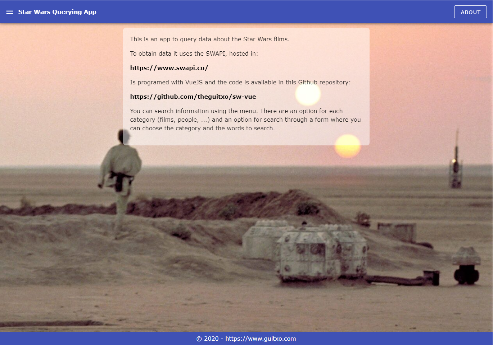
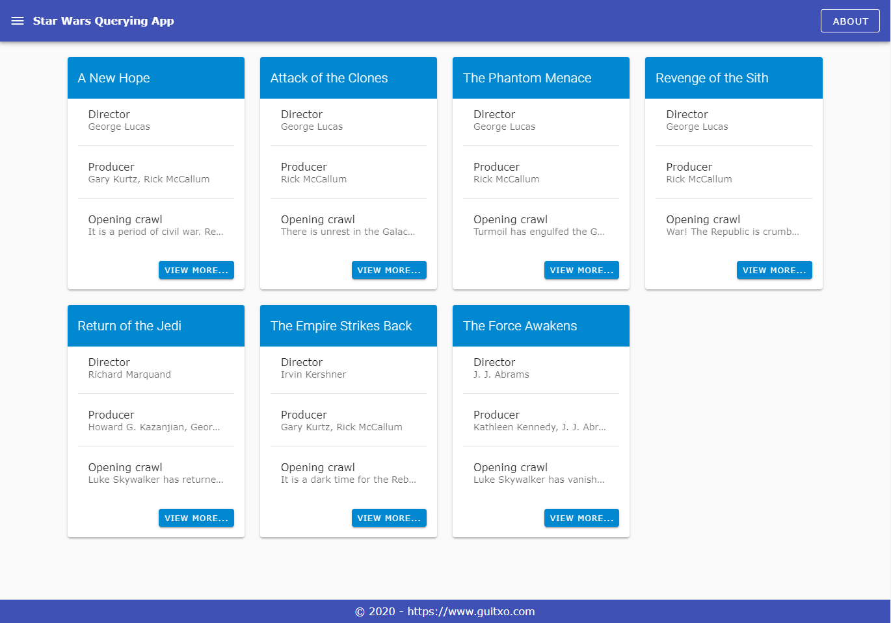
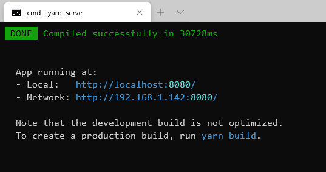

# Star Wars Querying App

## Description

This app permits to querying data about the Star Wars films.
Uses an API that you can locate at [https://www.swapi.co/](https://www.swapi.co/)




## Execute the app

After cloning the project it must to install the dependencies. To do this it must launch this command:

```
yarn install
```

When the dependencies are installed, you can launch a local server to run the app with this command:

```
yarn serve
```

When server is available, the console shows this message:



In a browser, enter the url indicated by the server according to if you want to access from the local machine or from a network machine.

## Demo

You can see a demo of the app here:

[Demo](http://sw-vue.guitxo.com/)